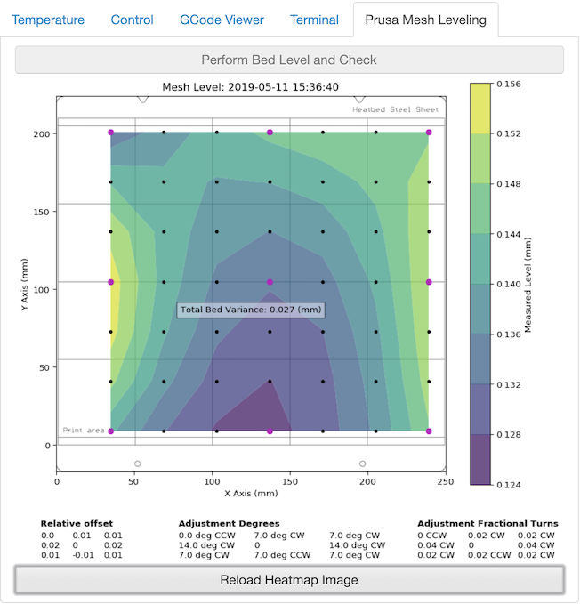

# OctoPrint-PrusaMeshMap

## This plugin is undergoing beta testing! ##

## Description

This plugin takes Prusa's G81 mesh level output and translates it into an easy to read heatmap using matplotlib.

Upon installation, you will have a "Prusa Mesh Leveling" tab:

Clicking "Perform Bed Level and Check" will execute a bed level operation and status check using a GCode script defined in the settings:

It should be noted that the heatmap image **will not** reload automatically. To reload, click "Reload Heatmap Image" below the heatmap. This is to allow you to be paying attention and see how your new bed level result changes.

## Setup

Install via the bundled [Plugin Manager](https://github.com/foosel/OctoPrint/wiki/Plugin:-Plugin-Manager)
or manually using this URL:

    https://github.com/ff8jake/OctoPrint-PrusaMeshMap/archive/master.zip
